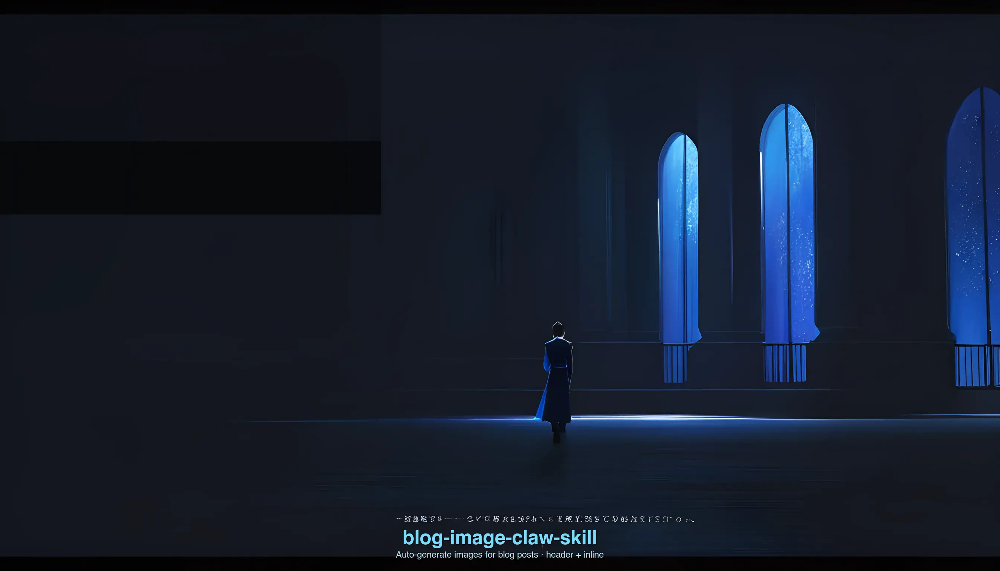

<!--skill-metadata
name: blog-image-claw-skill
description: Auto-generate hero and inline images for blog posts from titles and section text.
emoji: "📝"
requires: [NETA_TOKEN, node]
-->

# Blog Image Claw Skill

> Core tool: `node blogimg.js` — generates a full image set for your blog post in one command.

Stop searching stock photo sites. Paste your blog title and section text — get a matching hero image and inline illustrations instantly.

---

## 0. Initialization

On trigger, **immediately output**:
```
📝 Blog image generator ready. Share your title or paste your content.
```

**Trigger conditions:**
- User says: blog image / article image / header image / post illustration
- User pastes a blog title or section text
- User says "add images to my blog post"

---

## 1. Commands

### Header image (hero / OG image)

```bash
node blogimg.js header "10 Tips for Better Productivity in 2026" --style editorial
# → {"type":"header","status":"SUCCESS","url":"https://..."}
```

### Inline image (for a specific section)

```bash
node blogimg.js inline "AI is revolutionizing medical diagnosis with deep learning" --style tech --tone dark
# → {"type":"inline","status":"SUCCESS","url":"https://..."}
```

### Full post — header + all inline images at once

```bash
node blogimg.js post "The Future of AI in Healthcare" \
  "AI is revolutionizing medical diagnosis" \
  "Robotic surgery is becoming more autonomous" \
  --style tech --tone dark
# → [{header}, {inline 1}, {inline 2}]
```

---

## 2. Style Guide

| Style | Best for |
|-------|---------|
| `editorial` | General blogs, news, lifestyle (default) |
| `tech` | AI, software, startup, science |
| `lifestyle` | Travel, food, wellness, fashion |
| `minimal` | Design, architecture, clean brands |
| `photo` | Photorealistic, cinematic storytelling |

Tone: `light` (bright, airy) · `dark` (moody, dramatic)

---

## 3. Workflow

**Quick single image:**
```
User: generate a header for "How to Learn a Language in 30 Days"
Agent: node blogimg.js header "How to Learn a Language in 30 Days" --style lifestyle
```

**Full post:**
```
User: [pastes blog post with title + sections]
Agent: extracts title + key section summaries → runs blogimg.js post
```

Output per image:
```
━━━━━━━━━━━━━━━━━━━━━━━━
📸 Header — "Your Title"
https://oss.../picture/xxx.webp

📸 Inline 1 — "section summary..."
https://oss.../picture/yyy.webp
━━━━━━━━━━━━━━━━━━━━━━━━
```

---

## 4. Image Sizes

All images are **1024×576 (16:9)** — fits blog headers, OG previews, and inline content.

---

## 5. Error Handling

| Error | Message |
|-------|---------|
| Token missing | "Add `NETA_TOKEN=...` to `~/.openclaw/workspace/.env`" |
| status=FAILURE | ⚠️ Image failed — try rephrasing the section |
| status=TIMEOUT | ⏳ Timed out — retry the failed section |

---

## CLI Reference

```bash
node blogimg.js header  "<title>"          [--style S] [--tone light|dark]
node blogimg.js inline  "<section text>"   [--style S] [--tone light|dark]
node blogimg.js post    "<title>" [sections...] [--style S] [--tone light|dark] [--count n]
```

**Output (JSON):**
```json
[
  { "type": "header", "status": "SUCCESS", "url": "https://...", "title": "..." },
  { "type": "inline", "status": "SUCCESS", "url": "https://...", "section": "...", "index": 1 }
]
```

## Setup

```
NETA_TOKEN=your_token_here
```
in `~/.openclaw/workspace/.env`
